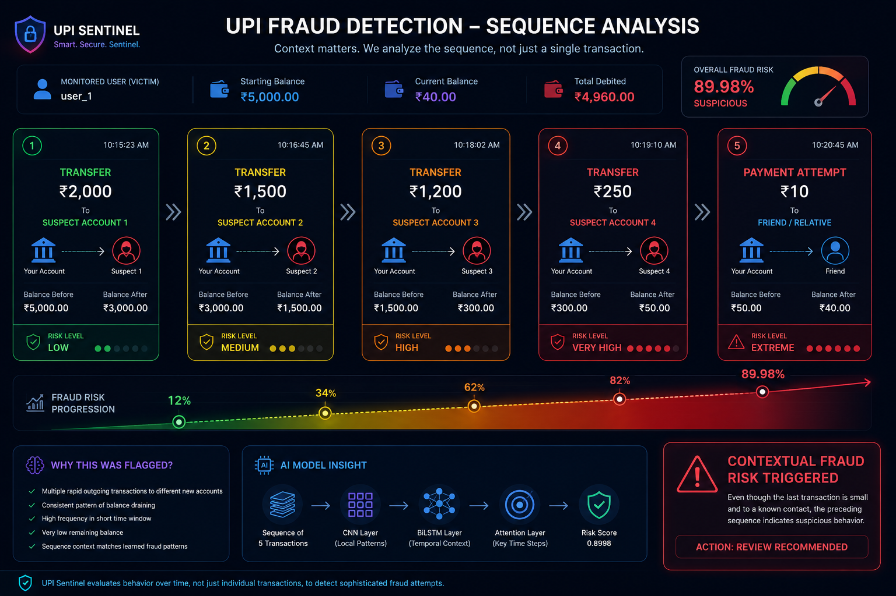
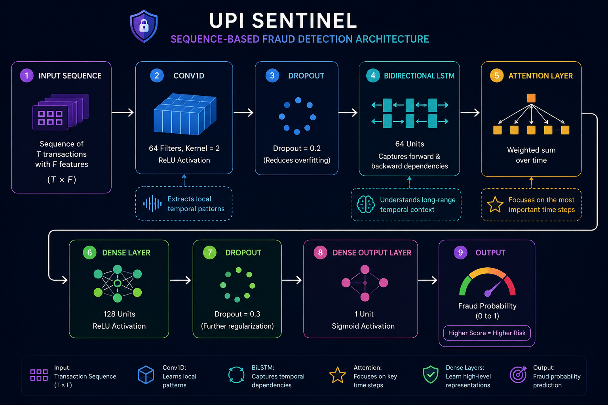
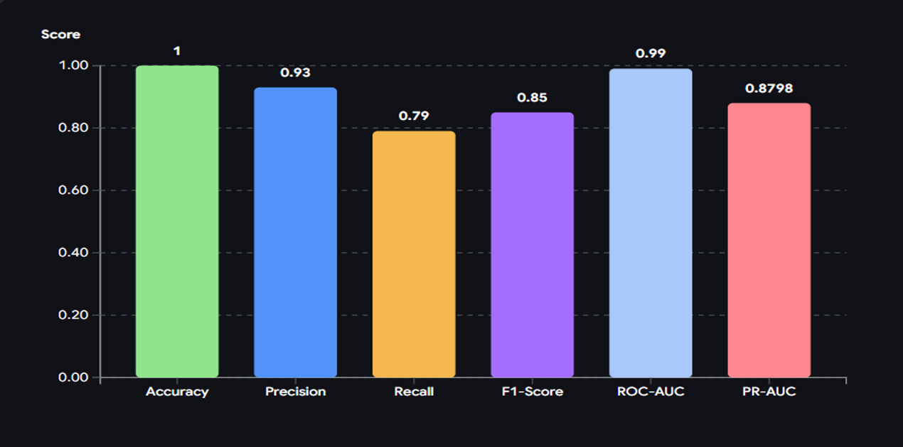

# 🚨 UPI Sentinel — Contextual Fraud Detection using Deep Learning

[](https://deemonduck-upi-sentinel.hf.space)
[](https://huggingface.co/spaces/DeemonDuck/upi-sentinel)


# 📌 Overview

UPI Sentinel is a sequence-based fraud detection system designed to analyze contextual transaction behavior instead of evaluating transactions independently.

Traditional fraud systems often rely on isolated transaction analysis, making them less effective against contextual financial fraud patterns.

This project combines:

* CNN for local transaction pattern extraction
* BiLSTM for temporal behavioral understanding
* Attention mechanism for identifying important transaction steps
* FastAPI deployment for real-time inference
* Streamlit dashboard for live fraud monitoring

The system was trained and evaluated using multiple experimentation strategies on highly imbalanced financial transaction data.

---

# 🎥 Dashboard Demonstration

## Live Fraud Monitoring Dashboard


The dashboard demonstrates:

* Real-time transaction scoring
* Sliding-window sequence inference
* Fraud probability estimation
* Contextual risk analysis
* Live transaction history tracking

---

# 🧠 Problem Statement

Most fraud detection systems evaluate transactions independently.

However, real-world fraud often emerges through:

* Rapid account draining
* Sequential suspicious transfers
* Behavioral anomalies over time
* Abnormal spending progression

UPI Sentinel addresses this by analyzing transaction sequences using deep learning.

Instead of asking:

> “Is this transaction fraudulent?”

The system asks:

> “Does the recent behavioral sequence appear suspicious?”

---

# 🔍 Contextual Fraud Detection Example

## Sequence-Based Risk Escalation



### Example Scenario

A victim account starts with ₹5000 balance.

The following rapid transactions occur:

| Step | Transaction    | Balance Remaining |
| ---- | -------------- | ----------------- |
| 1    | ₹2000 TRANSFER | ₹3000             |
| 2    | ₹1500 TRANSFER | ₹1500             |
| 3    | ₹1200 TRANSFER | ₹300              |
| 4    | ₹250 TRANSFER  | ₹50               |
| 5    | ₹10 PAYMENT    | ₹40               |

Although the final ₹10 payment appears normal individually, the system flags it because the previous transaction sequence indicates suspicious account-draining behavior.

This demonstrates contextual sequence-based fraud detection.

---

# 🏗️ Model Architecture

## CNN → BiLSTM → Attention



### Architecture Flow

```text
Input Sequence
        ↓
Conv1D
        ↓
Dropout
        ↓
Bidirectional LSTM
        ↓
Attention Layer
        ↓
Dense Layers
        ↓
Fraud Probability Output
```

### Why this architecture?

### 🔹 CNN Layer

Extracts local transaction patterns such as:

* Sudden spending spikes
* Rapid repetitive transfers
* Abrupt balance changes

### 🔹 BiLSTM Layer

Learns temporal behavioral relationships across transaction history.

### 🔹 Attention Layer

Focuses on the most important transaction steps contributing to fraud probability.

---

# 📊 Experimental Results

## Final Model Performance


---

## Final Evaluation Metrics

| Metric    | Score  |
| --------- | ------ |
| Accuracy  | 1.00   |
| Precision | 0.91   |
| Recall    | 0.77   |
| F1 Score  | 0.83   |
| ROC-AUC   | 0.99   |
| PR-AUC    | 0.8798 |

---

## Experiment Comparison

| Experiment                 | Precision | Recall | F1 Score |
| -------------------------- | --------- | ------ | -------- |
| CNN + Random Undersampling | 0.13      | 0.94   | 0.23     |
| CNN + Class Weights        | 0.42      | 0.90   | 0.57     |
| CNN + BiLSTM + Attention   | 0.91      | 0.77   | 0.83     |

---

# ⚙️ Sequence Modeling Strategy

The system uses a sliding-window transaction sequence approach.

### Example

With sequence length = 5:

```text
[T1, T2, T3, T4, T5] → Prediction
[T2, T3, T4, T5, T6] → Prediction
[T3, T4, T5, T6, T7] → Prediction
```

This enables contextual behavioral analysis over time.

---

# 🧪 Experiments Conducted

## ✔ Random Undersampling

Reduced majority-class dominance.

## ✔ SMOTE

Synthetic minority oversampling.

## ✔ Class Weight Experiments

Tested multiple class weight combinations:

* Weight 5
* Weight 7
* Weight 10

## ✔ Sliding Window Variations

Evaluated multiple sequence lengths:

* Sequence Length = 5
* Sequence Length = 10

## ✔ Threshold Optimization

Experimented with:

* Best F1 threshold
* High-recall operating threshold

---

# 🚀 Deployment

## FastAPI Backend

The project exposes a real-time fraud detection API using FastAPI.

### Features

* Sequence-aware inference
* User-specific transaction buffers
* Sliding-window contextual analysis
* Fraud probability generation

### Run FastAPI

```bash
uvicorn run:app --reload
```

API Docs:

```text
http://127.0.0.1:8000/docs
```

---

## Streamlit Dashboard

Interactive fraud monitoring dashboard with:

* Live transaction inputs
* Fraud probability visualization
* Risk monitoring
* Sequence-history tracking

### Run Dashboard

```bash
streamlit run app.py
```

Dashboard URL:

```text
http://localhost:8501
```

---

# 📂 Project Structure

```text
UPI_Sentinel/
│
├── src/
│   ├── api.py
│   ├── inference.py
│   ├── preprocessing.py
│   ├── sequence_builder.py
│   ├── model_loader.py
│
├── artifacts/
│   ├── best_model.keras
│   ├── scaler.pkl
│   ├── label_encoder.pkl
│   ├── metadata.json
│
├── app.py
├── run.py
├── requirements.txt
│
├── assets/
│
└── README.md
```

---

# 🛠️ Tech Stack

| Category        | Technologies                |
| --------------- | --------------------------- |
| Language        | Python                      |
| Deep Learning   | TensorFlow / Keras          |
| Backend API     | FastAPI                     |
| Dashboard       | Streamlit                   |
| Data Processing | Pandas, NumPy, Scikit-learn |
| Visualization   | Matplotlib                  |
| Deployment      | Uvicorn                     |

---

# 🔐 Key Learnings

This project highlights several real-world machine learning challenges:

* Extreme class imbalance
* Precision vs Recall tradeoffs
* Threshold optimization
* Contextual sequence modeling
* Deployment consistency
* Real-time inference engineering
* Sliding-window behavioral analysis

---

# 👨‍💻 Author

Aditya Gupta

AI/ML Engineer • Deep Learning Enthusiast • Python Developer

---

# ⭐ Final Note

UPI Sentinel demonstrates how contextual sequence modeling can improve fraud detection beyond isolated transaction analysis.

The project combines:

* Deep learning experimentation
* Real-time deployment
* Sequential behavioral analysis
* Interactive visualization
* Practical inference engineering

into a complete end-to-end AI system.
